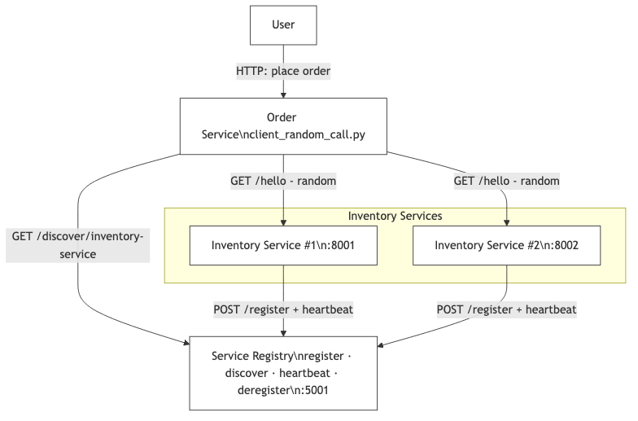

# Service Registry Architecture

## 📐 System Overview

```
┌─────────────────────────────────────────────────────────────────┐
│                     Service Registry System                      │
│                                                                   │
│  ┌────────────────────────────────────────────────────────┐    │
│  │              Service Registry (Port 5000)               │    │
│  │                                                          │    │
│  │  ┌──────────────────────────────────────────────────┐  │    │
│  │  │         In-Memory Registry Storage               │  │    │
│  │  │                                                   │  │    │
│  │  │  {                                                │  │    │
│  │  │    "user-service": [                             │  │    │
│  │  │      {                                            │  │    │
│  │  │        "address": "http://localhost:8001",       │  │    │
│  │  │        "registered_at": "2026-03-11T10:00:00",  │  │    │
│  │  │        "last_heartbeat": "2026-03-11T10:05:30"  │  │    │
│  │  │      }                                            │  │    │
│  │  │    ],                                             │  │    │
│  │  │    "payment-service": [...]                      │  │    │
│  │  │  }                                                │  │    │
│  │  └──────────────────────────────────────────────────┘  │    │
│  │                                                          │    │
│  │  ┌──────────────────────────────────────────────────┐  │    │
│  │  │         Background Cleanup Thread                │  │    │
│  │  │  • Runs every 10 seconds                         │  │    │
│  │  │  • Removes stale services (no heartbeat > 30s)   │  │    │
│  │  └──────────────────────────────────────────────────┘  │    │
│  └────────────────────────────────────────────────────────┘    │
# Service Registry — architecture summary

This document is a concise reference for the in-repo Service Registry demo. The interactive Mermaid diagram is at `architecture/diagram.mmd` and shows the client, registry, and two service instances.



Key points
- Registry port: 5001 (see `service_registry_improved.py`)  
- Services register and send heartbeats every 10s (configurable in code)  
- An instance is considered stale if no heartbeat is received for 30s  
- Background cleanup runs every 10s to remove stale instances

Core components
- Flask web server exposing: POST /register, POST /heartbeat, POST /deregister, GET /discover/<service>, GET /services, GET /health
- In-memory registry: dict mapping service -> list(instances). Access guarded by a threading.Lock
- Background cleanup thread that prunes stale instances

Typical flows (short)
- Registration: service -> POST /register -> registry stores address + timestamps
- Heartbeat: service -> POST /heartbeat every 10s -> registry updates last_heartbeat
- Discovery: client -> GET /discover/<service> -> registry returns active instances (heartbeat within timeout)
- Deregistration: service -> POST /deregister -> registry removes instance

Operational notes
- The demo scripts use ports: registry `:5001`, services `:8001` and `:8002` by default.  
- Run the end-to-end demo via `./run_assignment_demo.sh` or start components manually.  
- A lightweight smoke test is available at `tests/test_smoke.py` to verify registration + discovery.

If you want this doc to include sequence diagrams or configuration examples, I can add short snippets, but for now it intentionally stays concise and points readers to the executable diagram in `architecture/diagram.mmd`.

Benefits:
• High availability
• Horizontal scaling
• No single point of failure
• 10,000+ services
• 100,000+ instances
```

## 📈 Monitoring Points

```
┌─────────────────────────────────────────┐
│         Metrics to Monitor              │
├─────────────────────────────────────────┤
│                                         │
│ • Total services registered             │
│ • Total instances registered            │
│ • Active vs stale instances             │
│ • Registration rate (per second)        │
│ • Discovery rate (per second)           │
│ • Heartbeat rate (per second)           │
│ • Average response time                 │
│ • Error rate                            │
│ • Memory usage                          │
│ • CPU usage                             │
│                                         │
└─────────────────────────────────────────┘
```

This architecture provides a solid foundation for understanding distributed service discovery! 🚀